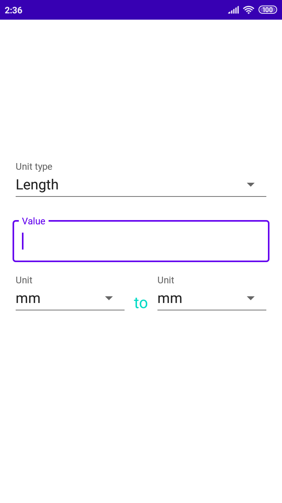
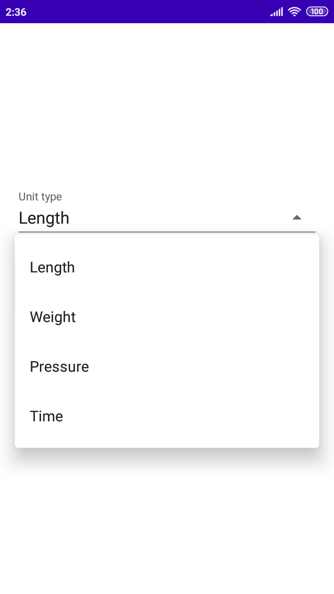
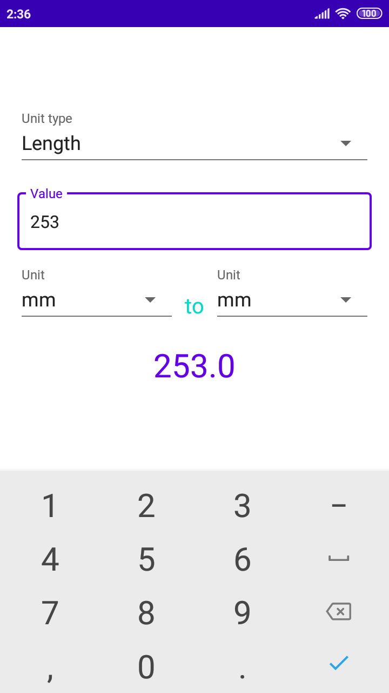
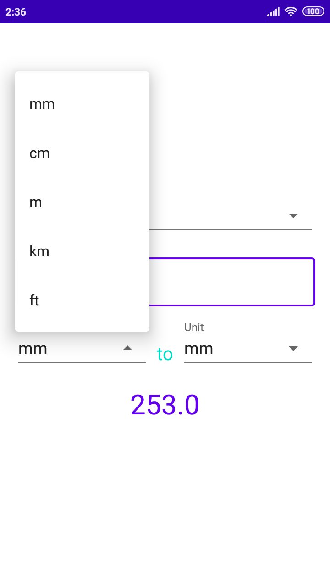
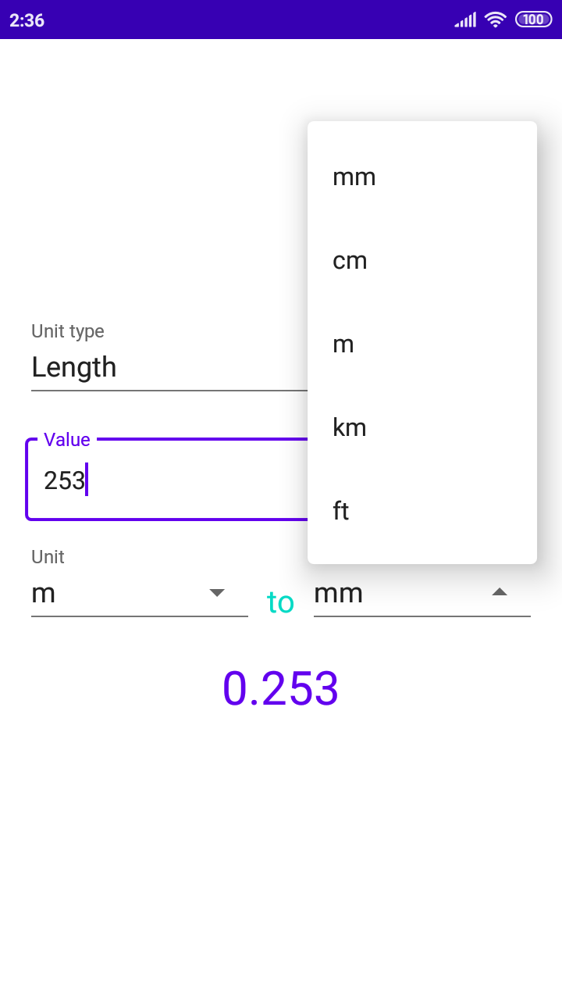
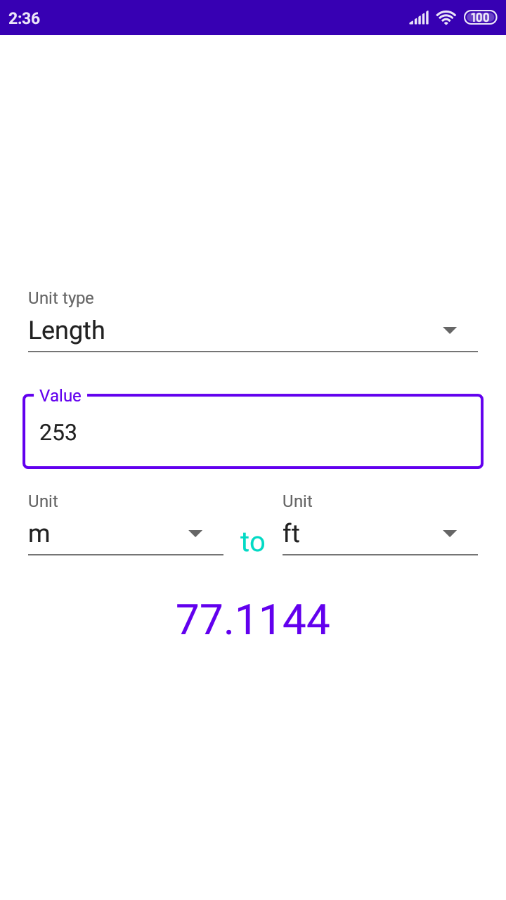

# unit-converter
Simple unit converter.

## Usage example

### Main layout

### Setting unit type

First, the unit type must be chosen from the dropdown menu.
Possible choices are:
* Length,
* Weight,
* Pressure,
* Time.

### Inputting the value

In the "Value" field, value to be converted must be inputted.
After this step, the result is already displaying and changing depending on settings.

### Setting input and output unit

The input and output unit must be chosen from the dropdown menus.
Possible choices are:
* Length:
  * millimeters,
  * centimeters,
  * meters,
  * kilometers,
  * feet.
* Weight:
  * milligrams,
  * grams,
  * kilograms,
  * tonnes,
  * pounds.  
* Pressure:
  * bars,
  * pascals,
  * megapascals,
  * atmospheres,
  * torrs.
* Time:
  * milliseconds,
  * seconds,
  * minutes,
  * hours,
  * days,
  * weeks,
  * months,
  * years,
  * decades,
  * centuries.
  

  

### Result

